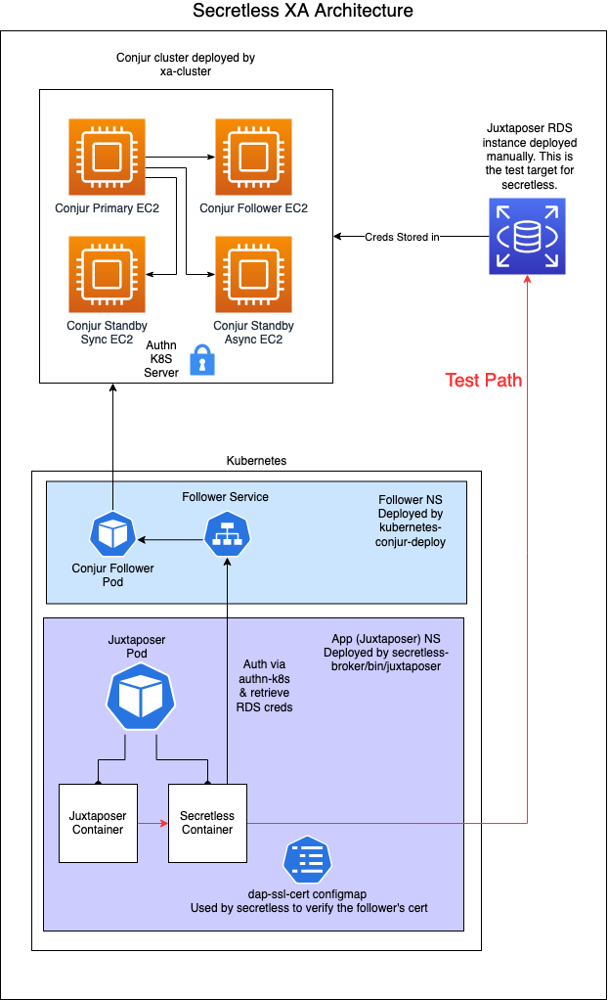

# Perf Test Agent

- [Perf Test Agent](#perf-test-agent)
- [Description](#description)
  - [**Status**: Alpha](#--status----alpha)
    - [**Warning: Naming and APIs are still subject to breaking changes!**](#--warning--naming-and-apis-are-still-subject-to-breaking-changes---)
- [Running the code locally](#running-the-code-locally)
  - [Start the test databases](#start-the-test-databases)
    - [PG](#pg)
    - [MySQL](#mysql)
    - [MSSQL](#mssql)
  - [Run Secretless Broker](#run-secretless-broker)
  - [Run Juxtaposer](#run-juxtaposer)
- [Running the code on OpenShift](#running-the-code-on-openshift)
  - [Configure and source the deployment scripts](#configure-and-source-the-deployment-scripts)
  - [Configure the backend details](#configure-the-backend-details)
  - [Configure the deployment template](#configure-the-deployment-template)
  - [Deploy the code to OpenShift](#deploy-the-code-to-openshift)
  - [Cleaning up](#cleaning-up)
- [CLI flags](#cli-flags)
  - [`-c`: Continue running after end of tests](#--c---continue-running-after-end-of-tests)
  - [`-f`: Path to configuration file](#--f---path-to-configuration-file)
  - [`-t`: Run tests for this duration](#--t---run-tests-for-this-duration)
- [Configuration](#configuration)
- [Format](#format)
- [Supported Drivers:](#supported-drivers-)
- [`comparison` options](#-comparison--options)
- [`formatters` options](#-formatters--options)
- [`backends` options](#-backends--options)

[Table of contents generated with markdown-toc](http://ecotrust-canada.github.io/markdown-toc/)

## Description

This tool can be used to compare timing data between arbitrary number of similar
services to evaluate differences in speed between a specified baseline backend
and the other backends.

Specifically, this tool is used here as a performance test agent deployed
alongside Secretless to compare the following scenarios:

| Backend       | Baseline          | Compare With                       | Connection Type |
| ---           |---                | ---                                |---              |
| MSSQL         | Direct connection | Secretless (persistent connection) | TCP port        |
| MySQL         | Direct connection | Secretless (persistent connection) | Unix socket     |
| MySQL         | Direct connection | Secretless (persistent connection) | TCP port        |
| Postgres      | Direct connection | Secretless (persistent connection) | Unix socket     |
| Postgres      | Direct connection | Secretless (persistent connection) | TCP port        |
| MSSQL         | Direct connection | Secretless (recreated connection)  | TCP port        |
| MySQL         | Direct connection | Secretless (recreated connection)  | Unix socket     |
| MySQL         | Direct connection | Secretless (recreated connection)  | TCP port        |
| Postgres      | Direct connection | Secretless (recreated connection)  | Unix socket     |
| Postgres      | Direct connection | Secretless (recreated connection)  | TCP port        |

All scenarios can be run with limits as either minimum number of rounds completed or a
time-limited duration.

We compare the following results:

- Returned values versus expected values
- Number of rounds (single-shot tests runs) completed
- Average/Min/Max single-shot test duration
- Error count, error messages, and percentage of errors
- Differences in timing (percentage-based) between runs temporaly close
- Percentage of single-shot runs that are above the specified baseline threshold
- 90% confidence interval (percentage-based) of test runs as compared to the
baseline backend.

Note: More comparison types may be added in the future.

---

### **Status**: Alpha

#### **Warning: Naming and APIs are still subject to breaking changes!**

---

## Running the code locally

You can run and test this code on your machine easily with a few things:
- [Docker](https://docker.com)
- [Golang](https://golang.org/dl/) 1.12 or higher
- [Secretless-broker](https://github.com/cyberark/secretless-broker) (optional)
- A writable folder for shared socket files (e.g. `/tmp` in these configurations) if you're using
socket files (optional)

### Start the test databases

#### PG

```
docker run --name pg-test-db \
           -p 5433:5432 \
           -e POSTGRES_USER=myuser \
           -e POSTGRES_PASSWORD=mypassword \
           -e POSTGRES_DB=mydb \
           -d \
           postgres
```

#### MySQL

```
docker run --name mysql-test-db \
           -p 3307:3306 \
           -e MYSQL_ROOT_PASSWORD=myrootpassword \
           -e MYSQL_USER=myuser \
           -e MYSQL_PASSWORD=mypassword \
           -e MYSQL_DATABASE=mydb \
           -d \
           mysql:5
```

#### MSSQL

```
docker run --name mssql-test-db \
           -p 1434:1433 \
           -e ACCEPT_EULA=Y \
           -e SA_PASSWORD="MYp4ssword1" \
           -d \
           mcr.microsoft.com/mssql/server:2017-latest
```

### Run Secretless Broker

_Note: This step is optional but it is required for this specific example since it tests the broker's
performance._

- Clone the [secretless-broker repository](https://github.com/cyberark/secretless-broker) (`git clone https://github.com/cyberark/secretless-broker`).
- Create the following `secretless.yml` file in that folder:
<details>
  <summary><code>secretless.yml</code></summary>
  <p>

```yaml
version: 2
services:
  mysql-socket:
    connector: mysql
    listenOn: unix:///tmp/mysql
    credentials:
      username: myuser
      password: mypassword
      host: 127.0.0.1
      port: 3307
      sslmode: disable

  pg-socket:
    connector: pg
    listenOn: unix:///tmp/.s.PGSQL.5432
    credentials:
      username: myuser
      password: mypassword
      host: 127.0.0.1
      port: 5433
      sslmode: disable

  mssql-tcp:
    connector: mssql
    listenOn: tcp://0.0.0.0:1433
    credentials:
      username: sa
      password: MYp4ssword1
      host: 127.0.0.1
      port: 1434
```

  </p>
</details>

Finally, start Secretless Broker with:

```
go run cmd/secretless-broker/main.go -f secretless.yml
```

### Run Juxtaposer

- Open a new terminal while leaving the Secretless Broker to run in the background.
- Go into the secretless-broker's `bin/juxtaposer` folder (`cd bin/juxtaposer`).
- Create the following `juxtaposer.yml` file in that folder and make any relevant changes to it depening on what
database backend you want to test:

<details>
  <summary><code>juxtaposer.yml</code></summary>
  <p>
    
```yaml
---
#driver: mssql
#driver: mysql-5.7
driver: postgres

comparison:
  baselineBackend: pg_direct
#  baselineBackend: mysql_direct
#  baselineBackend: mssql_direct
#  recreateConnections: true
#  sqlStatementType: select
#  rounds: 1000
#  rounds: infinity
#  baselineMaxThresholdPercent: 120
  threads: 5
  silent: false

formatters:
  json:
    outputFile: ./results.json
  stdout:

backends:
  pg_secretless:
    host: /tmp

  pg_direct:
    host: localhost
    port: 5433
    username: myuser
    password: mypassword
    sslmode: disable
    debug: false

  mysql_secretless:
    host: /tmp/mysql
    ignore: true

  mysql_direct:
    host: localhost
    port: 3307
    username: myuser
    password: mypassword
    sslmode: disable
    debug: false
    ignore: true

  mssql_secretless:
    host: 127.0.0.1
    ignore: true

  mssql_direct:
    host: 127.0.0.1
    port: 1434
    username: sa
    password: MYp4ssword1
    ignore: true
```

</p>
</details>

> Note: Be sure to modify the value for `ignore` for each backend
> you wish to run against.

Finally, start Juxtaposer with:

```
go run main.go -f juxtaposer.yml
```

## Running the code on OpenShift

Running the code on an OpenShift cluster is done through scripts in the `deploy/` folder.
Ensure that you have:
- Databases that you are using for your tests already deployed
- Credentials for those databases
- [Docker](https://docker.com)
- [`oc` CLI tool](https://docs.openshift.com/container-platform/3.11/cli_reference/get_started_cli.html)
- Configured `oc`/`kubectl` context
- A configured namespace (`project` in OpenShift terminology)

Juxtaposer is deployed on kubernetes as part of secretless xa tests. The following
diagram shows the architecture used:



### Configure and source the deployment scripts

Main configuration of the deployment scripts is done through the [./deploy/bootstrap.sh](deploy/bootstrap.sh)
environment variables. Make sure to change these according to your deployment and
source the file with:
```
source ./deploy/bootstrap.sh
```

### Configure the backend details

Depending on the backend driver and database details, configure the appropriate 
`./deploy/juxtaposer_${CONFIG_TEMPLATE}.yml` file and add/replace any backend
details that are specific to your deployment. This usually includes changes to
majority of the `backends` section of the file but depending on what you might
be testing, it could include other fields too.

### Configure the deployment template

With the configuration files ready, the last part is configuring the deployment
command for Juxtaposer in [`./deploy/juxtaposer_deployment_template.yml`](deploy/juxtaposer_deployment_template.yml)
file. This will be influenced heavily by what type of testing you are doing on
the codebase and may be changed depending on your needs.

- If you are running round-based tests, uncomment the following line of Juxtaposer container:
```
...
args: ["-c", "-f", "/etc/${APP_NAME}/${APP_NAME}_${CONFIG_TEMPLATE}.yml"]
...
```
- If you are running time-based tests, uncomment the following line of Juxtaposer container:
```
...
args: ["-c", "-t", "${TEST_DURATION}", "-f", "/etc/${APP_NAME}/${APP_NAME}_${CONFIG_TEMPLATE}.yml"
...
```
- If you will be performing output parsing manually, uncomment the following line of Juxtaposer container:
```
...
command: ["sh", "-c", "juxtaposer -t ${TEST_DURATION} -f /etc/${APP_NAME}/${APP_NAME}_${CONFIG_TEMPLATE}.yml &> /tmp/output.txt && echo 'done' && ls -la /tmp/output.txt && sleep 999d"]
...
```
- If you are developing Juxtaposer code, uncomment the following line of Juxtaposer container:
```
...
command: [ "/bin/sleep", "999d" ]
...
```

### Deploy the code to OpenShift

With all of the files fixed up and `bootstrap.sh` sourced, you can then deploy
things to Openshift with:
```
./deploy/start
```

Results will be present either in Docker logs or on the filesystem depending on the
start command and formatter configuration. Containers will remain running until
they are manually torn down unless you remove the [`-c`](#-c-continue-running-after-end-of-tests)
flag from the startup command.

### Cleaning up

To remove all deployments and clean up resources run:
```
./deploy/stop
```

## CLI flags

### `-c`: Continue running after end of tests

Leaves the process running after the tests are complete and the results are
printed. This protects the data from container log reaping.

### `-f`: Path to configuration file

Overrides the default configuration file path, which is `./juxtaposer.yml`.

### `-t`: Run tests for this duration

Run tests for a specified time rather than a number of loops.  Uses Golang's
[ParseDuration](https://golang.org/pkg/time/#ParseDuration) format to specify
time (e.g. `10h5m3s`).

## Configuration

Configuration is specified either with a default `juxtaposer.yml` in the current
directory or overridden by `-f` CLI flag.

## Format

A configuration file looks like this:

```yaml
driver: <DRIVER_NAME>

comparison:
  baselineBackend: backend1

formatters:
  stdout:

backends:

  backend1:
    host: <HOST>
    port: <PORT>
    username: <USERNAME>
    password: <USERNAME>
    sslmode: disable

  backend2:
    host: <PATH_TO_SOCKET>
```

## Supported Drivers:

- `mssql`
- `mysql-5.7`
- `postgres`

## `comparison` options

1. `baselineBackend`, `string`
This setting is linked to a named backend to indicate the baseline backend
against which all calculation will be compared.

1. (optional) `recreateConnections`, `bool`, default: `false`
This setting decides if the connections during testing will be recreated
on each test (`true`) or will the initial connection be opened only once
and then subsequent tests run on that opened connection (`false`).

1. (optional) `sqlStatementType`, `string`, default: `select`
This setting decides what SQL style of comparison will be run. Currently
only `select` is supported.

1. (optional) `rounds`, `int`, default: `1000`
This setting decides how many loops the main test run will iterate over all
the defined backends. This setting is ignored if time-based CLI flag is used.
This field also supports a special keyword `infinity` that lets the tests run
forever or until the user sends an interrupt signal. Note that this indicates
only the _minimum_ amount of runs that all backends will be iterated over.

1. (optional) `threads`, `int`, default: `1`
This setting selects how many parallel routines (threads) will be used for each
backend testing. Increasing this setting will mean that there will be a proportional
load testing increase on the service per unit of time.

1. (optional) `baselineMaxThresholdPercent`, `int`, default: `120`
This setting decides how slow (percentage-wise) can a non-baseline backend be
before it is counted as "exceeding threshold".

1. (optional) `silent`, `bool`, default: `false`
When this setting is turned on, only minimal test run messages are displayed during
runs.

## `formatters` options

This key-value map indicates what formatters are run at the end of tests to handle
aggregated results. Currently only `json` and `stdout` are supported. `json` formatter
currently also supports `outputFile` options which can be used to send the output data
from it to a file instead of stdout.

## `backends` options

This key-value map lists all backends that should be tested as part of the agent's
running.

Options are as follows:
```
host: Hostname (or socket address) that the driver will use. Note that for PG driver and sockets, this is the *folder* instead of the path to the socket file.
port: Port to use when connecting to the backend
username: Username to use for connecting to the backend. Some drivers do not need this setting.
password: Password to use for connecting to the backend. Some drivers do not need this setting.
sslmode: SSL mode to use for connecting to the backend. Some drivers do not need this setting.
debug: Print out verbose information about this backend test runs
ignore: If set to true, the agent will ignore this backend
```
