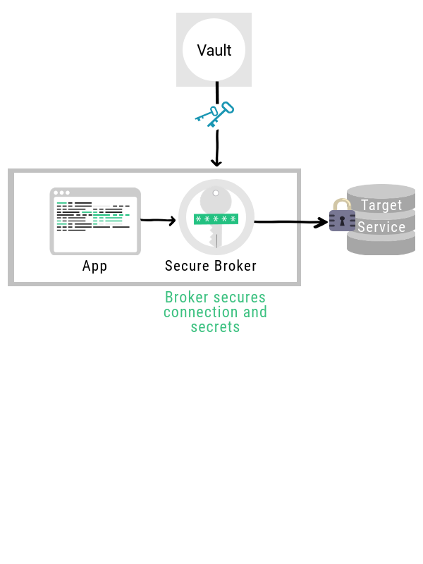

How does it work?

In a Secretless deployment, when a client needs access to a target service it doesn't try and make a direct connection to it. Instead, it sends the request through its Secretless connection broker.

  

The Secretless connection broker authenticates with a secrets vault and obtains an identity credential. This identity credential is managed securely within Secretless, and used to obtain a backend connection secret such as database password from the secrets vault. The connection secrets are managed entirely within the Secretless process, and never exposed to the client. The Secretless connection broker uses the connection secret to establish a connection to the target service and then transfers data between the client and the target.

Standard Workflow

1. A Client (user or code) connects to the Secretless Connection Broker (a local service) to obtain a connection to the Target Service (a database, server or web service).
1. The Secretless Connection Broker authenticates with the  Vault to obtain an Identity Credential, which is managed securely within the Connection Broker process.
1. The Secretless Connection Broker uses the Identity Credential to obtains secrets which allow access to the Target Resource. Secrets are managed securely by the Connection Broker process.
1. Secretless Connection Broker uses the secrets to connect to the Target Service.
1. Secretless Connection Broker pipes traffic between the Client and the Target Service.
1. If a secret is changed, the Connection Broker automatically obtains out the new secret and uses it to establish new connections.  

The Secretless Connection Broker is a proxy which intercepts traffic to the backend service and performs the authentication phase of the backend protocol. The data-transfer phases of the protocol are direct pass-through between the client and backend service.

Examples of protocols which can be brokered:  

-  Database protocols such as Oracle, Postgresql, MySQL, NoSQL flavors, etc.
-  HTTP via Authorization header
-  SSH, via MITM or by implementing an ssh-agent   

Any published protocol can be supported in Secretless. Software code in Secretless is generally required for each new protocol. See <a href="reference.html">Handlers</a>.

<!-- TODO - link to handler section of reference page -->

The Connection Broker typically runs locally alongside the client application. Authentication between the Client and the Connection Broker is managed by the operating system, e.g. local connection via Unix socket or HTTP connection to 127.0.0.1.  In container-managed environments such as Kubernetes, the Connection Broker can be a “sidecar” container which is securely networked to the application container.
