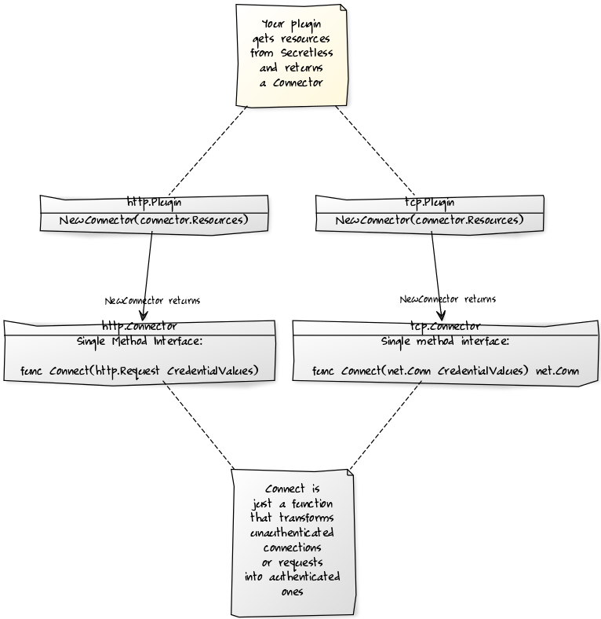

# Secretless Connector Plugins

For general info on Secretless plugins, please refer to the [plugin README](../README.md).

Secretless has built-in support for PostgreSQL, MySQL, Microsoft SQL Server, APIs that use basic
HTTP authentication, and many other target services.

If you want to use Secretless with a target service that is not supported out of
the box, you can create Service connector plugins to extend Secretless to support
any target service.

If you know Go and understand your target service's authentication protocol, you
can write a connector for it. This guide provides all of the information you'll need.

You can also use our [connector templates](../../../../examples/connector_templates) to add
your new connector plugin.

The Secretless team is continually adding support for new databases and services, but we encourage outside
contributions as well. If you write a connector plugin that you'd like to share with the community, please
[let us know](https://secretless.io/community.html) or consider sending us a PR!

## Technical Overview

As described in the [plugin README](../README.md), Secretless uses [Go plugins](https://golang.org/pkg/plugin/)
to produce shared object library files (with `.so` extensions) instead of a normal executable. The `.so` library files can
be loaded at runtime to expand the number of target services your Secretless instance supports.

There are two types of service connector plugins that we currently support - TCP and HTTP.
A good general rule for deciding which to implement is that TCP is appropriate for databases
and HTTP for APIs. If you want to write a plugin and aren’t sure which option to choose,
please [get in touch with us](https://discuss.cyberarkcommons.org/c/secretless-broker).

Technically, a Secretless service connector plugin is just a Go shared library
file that implements two functions.

- TCP connectors implement:
  ```go
  PluginInfo() map[string]string
  GetTCPPlugin() tcp.Plugin
  ```
  where `tcp.Plugin` is defined as follows (from `github.com/cyberark/secretless-broker/pkg/secretless/plugin/connector/tcp`):
  ```go
  package tcp

  type Plugin interface {
    NewConnector(connector.Resources) Connector
  }

  type Connector interface {
    Connect(net.Conn, connector.CredentialValuesByID) (net.Conn, error)
  }
  ```

- HTTP connectors implement:
  ```go
  PluginInfo() map[string]string
  GetHTTPPlugin() http.Plugin
  ```
  where `http.Plugin` is defined as follows (from `github.com/cyberark/secretless-broker/pkg/secretless/plugin/connector/http`):
  ```go
  package http

  type Plugin interface {
    NewConnector(connector.Resources) Connector
  }

  type Connector interface {
    Connect(*http.Request, connector.CredentialValuesByID) error
  }
  ```

We'll get into the details below, but at a high level your connector is what is
returned by 'NewConnector'. It is an interface with one method that knows how to
transform an unauthenticated connection or request into an authenticated one.

To get that job done, Secretless provides you with `connector.Resources`
(detailed below) as well as the current credential values --  the secrets
you'll need to authenticate.  Your plugin users specify the location of those
secrets in `secretless.yml`, as described
[here](https://docs.secretless.io/Latest/en/Content/References/connectors/overview.htm#ConfigureSecretlesstolistenfornewconnections)
and [here](https://docs.secretless.io/Latest/en/Content/Get%20Started/configuration.htm).
At runtime, Secretless fetches the values of those secrets and passes
them into your `Connector` function.



## Technical Details

This section describes the interfaces and types you'll need to use when authoring a plugin.

### `PluginInfo()`

This top level function is always required. It returns basic information about
your plugin. Its signature is:

```go
func PluginInfo() map[string]string
```

The returned map must have the following keys:

- `version`: The version of the plugin itself.  This allows plugin authors to
  version the plugins they write.
- `pluginAPIVersion`: The version of the Secretless plugin API your plugin is
  written for.  This allows the Secretless plugin API to change over time
  without breaking plugins.
- `type`: This must be either the string `"connector.tcp"` or the string
  `"connector.http"`
- `id`: A short, clear, unique name for use in logs and the `secretless.yml`
  config file.  Allowed characters are: lowercase letters, `_`, `:`, `-`, and
  `~`.
- `description`: A short summary of the plugin, not to exceed 100 characters.
  This may be used in the future by the secretless cmd line tool to list
  available plugins.

### `NewConnector`

In both the `tcp.Plugin` and `http.Plugin` interfaces, `NewConnector` returns a
`Connector`, a one-method interface that performs the actual authentication.
The method signature is slightly different depending on which interface you're
implementing.

When Secretless runs, it calls `NewConnector` once, and then holds onto the
returned `Connector`.  That `Connector` (remember: it's just a a single method)
is then called each time a new client connection requires authentication.

Both `NewConnector` methods take only one argument -- `connector.Resources` --
described [below](#connectorresources---argument-passed-to-your-constructor).

The real work is done by the `Connector` functions they return.

#### TCP `Connector`

This is the one method interface returned by `tcp.Plugin`'s `NewConnector()`,
and it's where your TCP authentication logic lives.  The method's signature is:

```go
func(net.Conn, connector.CredentialValuesByID) (net.Conn, error)
```

That is, it's passed the client's `net.Conn` and the current
`CredentialValuesById`, and returns an authenticated `net.Conn` to the target
service.  The authentication stage is complete after `Connector` is called.

Secretless now has both the client connection and an authenticated
connection to the target service.  The relationship between the client
connection, Secretless, and the authenticated target service connection looks
like this:

```
clientConn <--> Secretless <--> authdTargetServiceConn
```

At this point, Secretless becomes an invisible proxy, streaming bytes back and
forth between client and target service, as if they were directly
connected.

#### HTTP `Connector`

This is the one method interface returned by `http.Plugin`'s `NewConnector()`,
and it's where the http authentication logic lives.  The method's signature is:

```go
func(*http.Request, connector.CredentialValuesById) error
```

Here we are passed a pointer to an `http.Request` and `CredentialValuesById`, and
are expected to alter that request so that it contains the necessary
authentication information.  Typically, this means adding the appropriate
headers to a request -- for example, an `Authorization` header containing a
Token, or a header containing an API key.

Since HTTP is a stateless protocol, Secretless calls this function every
time a client sends an http request to the target server, so that every request
is authenticated.

### `connector.Resources` - Argument passed to your constructor

Everything that your Connector needs from the Secretless framework is exposed
through the `connector.Resources` interface, which is passed to your plugin's
constructor.  You need to retain a reference to `connector.Resources`, via
a closure, inside the `Connector` function returned by your constructor.
Here's the `connector.Resources` interface:

```go
package connector

type Resources interface {
  Config()          []byte
  Logger()          secretless.Logger
}
```

`Logger()` provides a basic logger that you can use for debugging and informational
logging.  `Config()` provides you resources specified in your `secretless.yml`
file.

Let's break down each method:

- `Config()` - Some connectors require additional, connector-specific
  configuration.  Anything specified in your connector's `config` section is
  passed back via this method as a raw `[]byte`.  Your code is responsible
  for casting those bytes back into a meaningful `struct` that your code can
  work with.
- `Logger()` - Returns an object similar to the standard library's
  `log.Logger`.  This lets you log events to stdout and stderr.  It respects
  Secretless's command line `debug` flag, so that calling `Debugf` or `Infof`
  does nothing unless you started Secretless in debug mode.  See below for
  details.

#### `secretless.Logger` Interface

Your code should never use the `fmt` or `log` packages, or write directly to
stdout or stderr.  Instead, call `Logger()` on your `connector.Resources` to get
a `secretless.Logger` with the following interface:

```go
type Logger interface {
  Debugf(format string, v ...interface{})
  Debug(msg string)
  Debugln(msg string)

  Infof(format string, v ...interface{})
  Info(msg string)
  Infoln(msg string)

  Warnf(format string, v ...interface{})
  Warn(msg string)
  Warnln(msg string)

  Errorf(format string, v ...interface{})
  Error(msg string)
  Errorln(msg string)

  Fatalf(format string, v ...interface{})
  Fatal(msg string)
  Fatalln(msg string)
}
```

The three `Debug` methods and the three `Info` methods do nothing unless you started
Secretless with the `Debug` command line flag set to true.  If you did start
Secretless in debug mode, the methods write to stdout.

The `Warn`, `Error`, and `Fatal` methods all write to stderr, regardless of
the current `Debug` mode.  

All the `Fatal` methods call `os.Exit(1)` after printing their message.

The `Logger` automatically prepends the service name specified in your `secretless.yml`
for the currently-running service to all messages. For example, if your
`secretless.yml` looks like:

```
version: "v2"
services:
  sample-service:
    protocol: pg
    listenOn: unix:///sock/.s.PGSQL.5432
    ...
```

then the `Logger` prepends `sample-service` to all messages.

## Examples

To see an example external connector, please take a look at our [test plugin](../../../../test/plugin).
You can also look at our internal plugins that also implement this interface:
- [http connector plugins](../../../../internal/plugin/connectors/http)
- [tcp connector plugins](../../../../internal/plugin/connectors/tcp)

To get started with adding your new connector plugin, please take a look at our 
[connector templates](../../../../examples/connector_templates).
